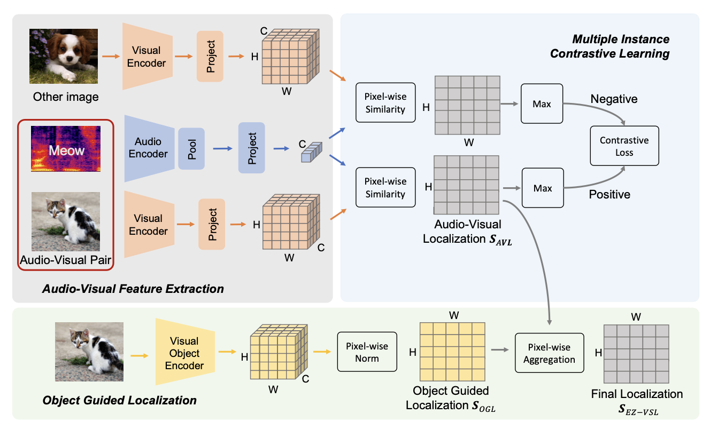
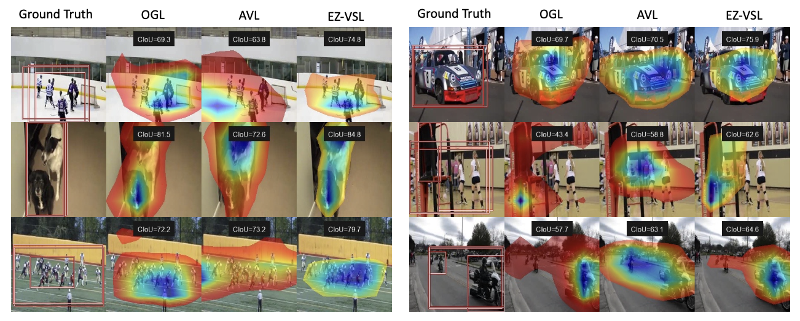

# Localizing Visual Sounds the Easy Way

Official codebase for EZ-VSL. 
EZ-VSL is a simple yet effective approach for Visual Sound Localization.
Please check out the paper for full details. 

[**Localizing Visual Sounds the Easy Way**]()<br>
Shentong Mo, Pedro Morgado<br>
arXiv 2022.

<div align="center">
  
</div>


## Environment

To setup the environment, please simply run

```
pip install -r requirements.txt
```

## Datasets

###  Flickr-SoundNet

Data can be downloaded from [Learning to localize sound sources](https://github.com/ardasnck/learning_to_localize_sound_source)

###  VGG-Sound Source

Data can be downloaded from [Localizing Visual Sounds the Hard Way](https://github.com/hche11/Localizing-Visual-Sounds-the-Hard-Way)

###  VGG-SS Unheard & Heard Test Data 

Data can be downloaded from [Unheard](https://github.com/stoneMo/EZ-VSL/blob/main/metadata/vggss_unheard_test.csv) and [Heard](https://github.com/stoneMo/EZ-VSL/blob/main/metadata/vggss_heard_test.csv)


## Model Zoo

We release several models pre-trained with EZ-VSL with the hope that other researchers might also benefit from them.

| Method |    Train Set   |     Test Set    |     CIoU     |  AUC  | url | args |
|:------:|:--------------:|:---------------:|:------------:|:-----:|:---:|:----:|
| EZ-VSL |   Flickr 10k   | Flickr SoundNet |     81.93    | 62.58 | [model](https://drive.google.com/drive/folders/1I9nyn8VGU4HFEBDpEUpqFz1ywWcqzC6C?usp=sharing) | [script](./scripts/test_flickr_with_flickr10k.sh) |
| EZ-VSL |   Flickr 144k  | Flickr SoundNet |     83.13    | 63.06 | [model](https://drive.google.com/drive/folders/1I9nyn8VGU4HFEBDpEUpqFz1ywWcqzC6C?usp=sharing) | [script](./scripts/test_flickr_with_flickr144k.sh) |
| EZ-VSL | VGG-Sound 144k | Flickr SoundNet |     83.94    | 63.60 | [model](https://drive.google.com/drive/folders/1I9nyn8VGU4HFEBDpEUpqFz1ywWcqzC6C?usp=sharing) | [script](./scripts/test_flickr_with_vggsound144k.sh) |
| EZ-VSL |  VGG-Sound 10k |      VGG-SS     |     37.18    | 38.75 | [model](https://drive.google.com/drive/folders/1I9nyn8VGU4HFEBDpEUpqFz1ywWcqzC6C?usp=sharing) | [script](./scripts/test_vggss_with_vggsound10k.sh) |
| EZ-VSL | VGG-Sound 144k |      VGG-SS     |     38.85    | 39.54 | [model](https://drive.google.com/drive/folders/1I9nyn8VGU4HFEBDpEUpqFz1ywWcqzC6C?usp=sharing) | [script](./scripts/test_vggss_with_vggsound144k.sh) |
| EZ-VSL | VGG-Sound Full |      VGG-SS     |     39.34    | 39.78 | [model](https://drive.google.com/drive/folders/1I9nyn8VGU4HFEBDpEUpqFz1ywWcqzC6C?usp=sharing) | [script](./scripts/test_vggss_with_vggsoundfull.sh) |
| EZ-VSL |    Heard 110   |    Heard 110    |     37.25    | 38.97 | [model](https://drive.google.com/drive/folders/1I9nyn8VGU4HFEBDpEUpqFz1ywWcqzC6C?usp=sharing) | [script](./scripts/test_heard_with_heard110.sh) |
| EZ-VSL |    Heard 110   |   Unheard 110   |     39.57    | 39.60 | [model](https://drive.google.com/drive/folders/1I9nyn8VGU4HFEBDpEUpqFz1ywWcqzC6C?usp=sharing) | [script](./scripts/test_unheard_with_heard110.sh) |


## Train & Test

For training an EZ-VSL model, please run

```
python train.py --multiprocessing_distributed \
    --train_data_path /path/to/Flickr-all/ \
    --test_data_path /path/to/Flickr-SoundNet/ \
    --test_gt_path /path/to/Flickr-SoundNet/Annotations/ \
    --experiment_name flickr_10k \
    --trainset 'flickr_10k' \
    --testset 'flickr' \
    --epochs 100 \
    --batch_size 128 \
    --init_lr 0.0001
```

For testing and visualization, simply run

```
python test.py --test_data_path /path/to/Flickr-SoundNet/ \
    --test_gt_path /path/to/Flickr-SoundNet/Annotations/ \
    --model_dir checkpoints \
    --experiment_name flickr_10k \
    --save_visualizations \
    --testset 'flickr' \
    --alpha 0.4
```

The training script supports the following training sets: `flickr`, `flickr_10k`, `flickr_144k`, `vggss`, `vggss_10k`, `vggss_144k` or `vggss_heard`.

For evaluation, it supports the following test sets: `flickr`, `vggss`, `vggss_heard`, `vggss_unheard`.

## Visualizations

The `test.py` script saves the predicted localization maps for all test images when the flag `--save_visualizations` is provided.
All visualizations for OGL, AVL and EZ-VSL localization maps are saved under `{model_dir}/{experiment_name}/viz/`.
Here's some examples.
<div align="center">
  
</div>

## Citation

If you find this repository useful, please cite our paper:
```
@article{mo2022EZVSL,
  title={Localizing Visual Sounds the Easy Way},
  author={Mo, Shentong and Morgado, Pedro},
  journal={arXiv preprint},
  year={2022}
}
```

